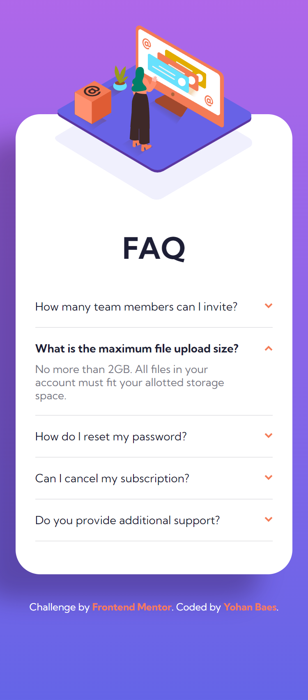
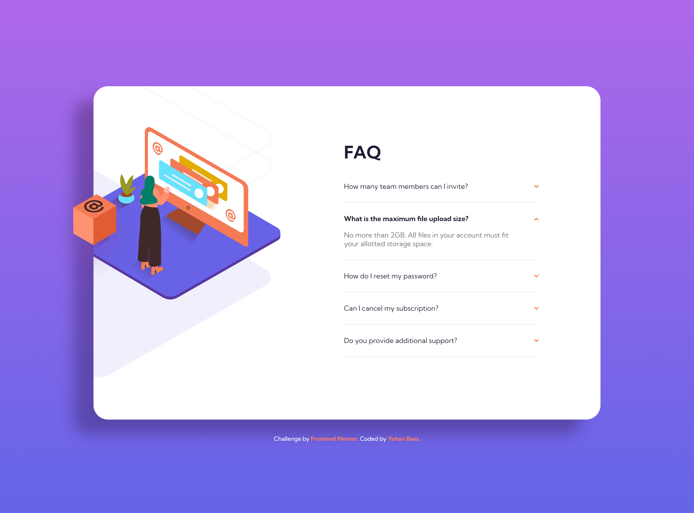

# Frontend Mentor - FAQ accordion card

This is a solution to the [FAQ accordion card challenge on Frontend Mentor](https://www.frontendmentor.io/challenges/faq-accordion-card-XlyjD0Oam).

## The challenge

Your challenge is to build out this page and get it looking as close to the design as possible.

## Screenshot

### mobile design

### desktop design

## Links

- Solution URL: https://www.frontendmentor.io/solutions/responsive-faq-accordion-card-qOipXYfTOU
- Live Site URL: https://raink31.github.io/022-FAQ-accordion-card/

## Built with

- HTML5
- CSS
- Javascript
- Flexbox
- CSS Grid
- Mobile First Workflow

## Author

- Frontend Mentor - https://www.frontendmentor.io/profile/Raink31
